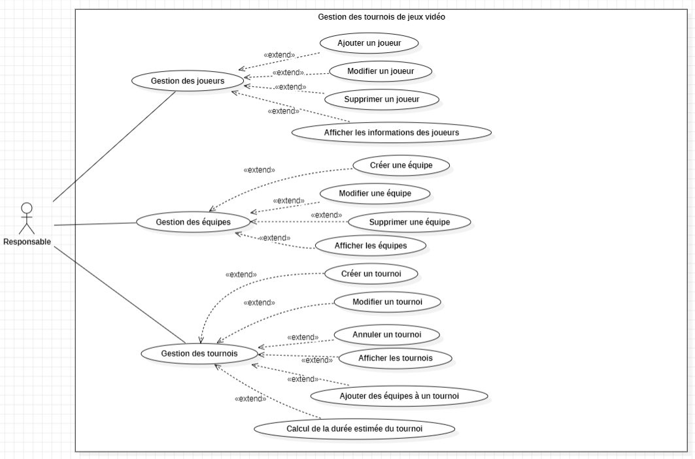
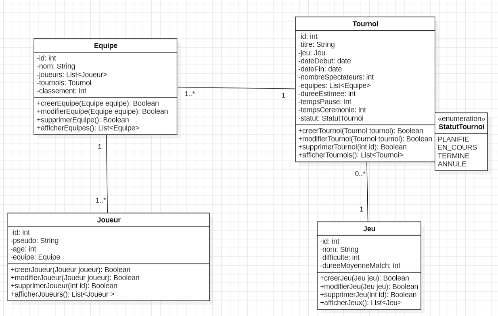

# Gestion de Tournois De Jeux Vidéo


## Description du projet

L'application **Gestion de Tournois De Jeux Vidéo** est conçue pour les organisations de jeux vidéo qui souhaitent gérer efficacement les tournois, les équipes, et les joueurs. Elle permet de suivre les inscriptions, d'organiser des équipes, de planifier des tournois, et de calculer les durées estimées des tournois avec des fonctionnalités avancées.

## Objectif général de l'application

L'objectif principal de cette application est de fournir un outil complet pour organiser et gérer des tournois de jeux vidéo. Les fonctionnalités incluent :
- Gestion des joueurs : inscription, modification, suppression, et affichage
- Gestion des équipes : création, gestion des joueurs, affichage
- Gestion des tournois : création, ajout/retrait d'équipes, suivi de l'état, et estimation de la durée des tournois

## Technologies utilisées

- **Langage de programmation** : Java 8
- **Frameworks** : Spring Core (pour IoC et DI), JPA (avec Hibernate pour l'accès aux données)
- **Base de données** : H2 (en mémoire pour le développement et les tests)
- **Gestion de dépendances** : Maven
- **Tests** : JUnit, Mockito, JaCoCo (pour la couverture de code)
- **Système de gestion de versions** : Git
- **Outils de gestion de projet** : JIRA (Scrum)

## Structure du projet

Le projet est structuré selon une architecture multi-couche pour séparer la logique métier, l'accès aux données, et la présentation :
- **Couche modèle** : entités JPA représentant les joueurs, équipes, et tournois
- **Couche repository** : accès aux données via JPA/Hibernate
- **Couche service** : logique métier, calculs, et gestion des entités
- **Couche utilitaire** : classes utilitaires pour les validations et les formats
- **Couche présentation** : menu console pour interagir avec l'application

## Description brève de l'architecture adoptée

Le projet suit une architecture basée sur les principes SOLID et les design patterns pour garantir une bonne extensibilité et maintenabilité :
- **Repository Pattern** : pour l'accès aux données
- **Singleton Pattern** : utilisé pour la gestion de l'`EntityManagerFactory` via la classe `JpaUtil`, garantissant une instance unique tout au long du cycle de vie de l'application pour gérer efficacement les connexions à la base de données.
- **Open/Closed Principle** : démontré avec l'extension `TournoiDaoExtension` pour un calcul avancé des durées de tournois
- **Spring IoC & DI** : pour gérer les dépendances entre les différentes couches via la configuration XML (`applicationContext.xml`)

## Instructions d'installation et d'utilisation

### Prérequis

- **Java 8** installé
- **Maven** installé
- Un IDE compatible avec Java (Eclipse, IntelliJ IDEA, etc.)

### Étapes pour configurer la base de données

La base de données utilisée est H2, qui est configurée pour fonctionner comme une base de données basée sur un fichier, ce qui permet de conserver les données même après la fermeture de l'application. Les fichiers de configuration sont situés dans `persistence.xml` et sont chargés automatiquement par JPA.

1. Ajouter la dépendance H2 dans le fichier `pom.xml` :

    ```xml
    <!-- H2 Database -->
        <dependency>
            <groupId>com.h2database</groupId>
            <artifactId>h2</artifactId>
            <version>2.3.232</version>
            <scope>runtime</scope>
        </dependency>
    ```

2. Ouvrir le fichier `applicationContext.xml` et vérifier que la configuration de la base de données H2 est correcte, en particulier l'URL de connexion :

    ```xml
    <bean id="entityManagerFactory" class="org.springframework.orm.jpa.LocalEntityManagerFactoryBean">
        <property name="persistenceUnitName" value="Akil"/>
        <property name="jakarta.persistence.jdbc.url" value="jdbc:h2:file:./data/tournoi;DB_CLOSE_DELAY=-1"/>
        <property name="jakarta.persistence.jdbc.driver" value="org.h2.Driver"/>
        <property name="jakarta.persistence.jdbc.user" value="sa"/>
        <property name="jakarta.persistence.jdbc.password" value=""/>
    </bean>
    ```

3. Vérifiez que la base de données H2 est configurée pour utiliser un fichier en définissant l'URL sous la forme `jdbc:h2:file:./data/tournoi;DB_CLOSE_DELAY=-1`. Cette configuration garantit que les données sont stockées dans un fichier local (`./data/tournoi`) et que la base de données ne se ferme pas automatiquement lorsque toutes les connexions sont terminées.

4. Aucune autre configuration n'est nécessaire pour H2, car les tables seront générées automatiquement à partir des entités JPA lors du démarrage de l'application.

### Comment lancer l'application

1. **Cloner le dépôt Git** :
    ```bash
    git clone <url-du-repo>
    cd gestion-tournoi-esport
    ```

2. **Compiler le projet avec Maven** :
    ```bash
    mvn clean install
    ```

3. **Générer le fichier JAR** :
    ```bash
    mvn package
    ```

4. **Lancer l'application** :
    ```bash
    java -jar target/gestion-tournoi-esport.jar
    ```

5. **Interagir avec le menu console** :
    - Suivre les instructions pour gérer les joueurs, équipes, et tournois.
    - Le menu vous permet de créer, modifier, supprimer, et afficher des entités, ainsi que de gérer les durées estimées des tournois.

## Tests

- **Tests unitaires** :
    - Exécutés avec JUnit et Mockito pour s'assurer du bon fonctionnement des composants individuels.
    - Couverture de code mesurée avec JaCoCo.
- **Test d'intégration** :
    - Couvre l'interaction entre les couches DAO et service, validant les processus complets de gestion de tournoi.
# Conception UML
## Diagramme de cas d'utilisation : 

## Diagramme de classe :
